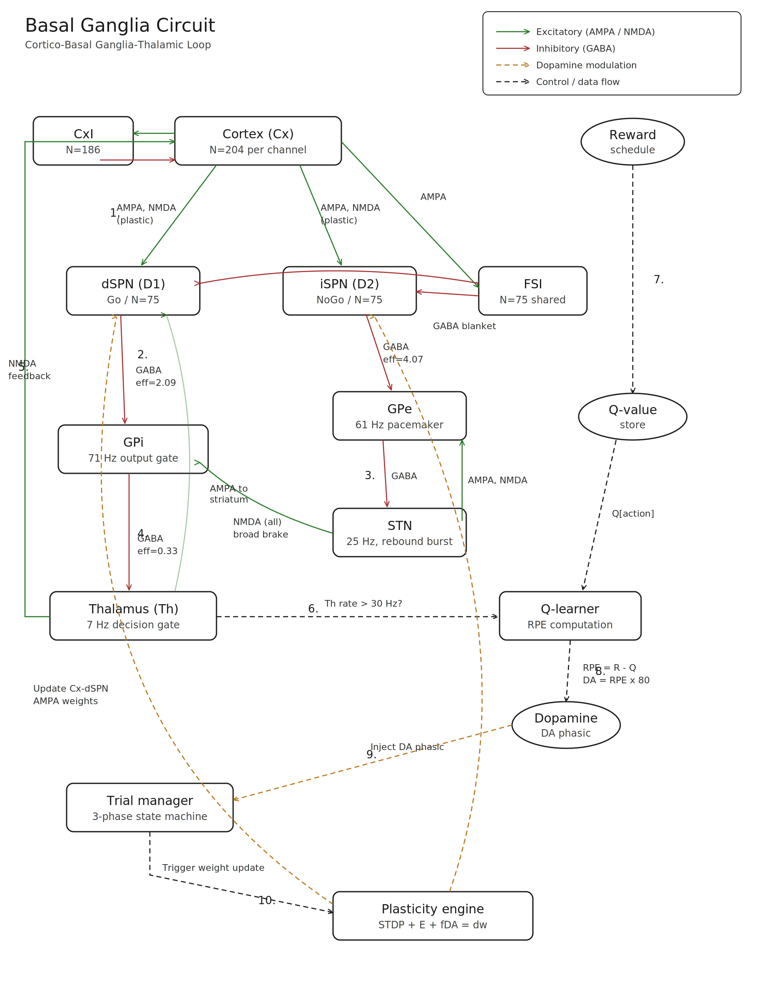

# BioMind-BG: Biologically Faithful Basal Ganglia Simulation

A spiking neural network model of the cortico-basal-ganglia-thalamic (CBGT) circuit implemented in pure Python/NumPy.

## What It Does

Simulates ~3,000 leaky integrate-and-fire neurons organized into 9 brain nuclei, connected by 27 biologically constrained pathways across three receptor types (AMPA, GABA-A, NMDA). The network makes decisions through thalamic threshold crossing and learns from reward through dopamine-modulated three-factor synaptic plasticity.

## System Architecture

<p align="center">
  
</p>

**Decision flow:**
1. Cortex excites dSPN (Go) and iSPN (NoGo) through plastic AMPA synapses
2. dSPN inhibits GPi (disinhibition gate), iSPN inhibits GPe
3. GPe-STN loop: STN broadcasts broad brake to GPi via NMDA
4. GPi tonically inhibits Thalamus (71 Hz output gate)
5. Thalamus feeds back to Cortex (NMDA feedback loop)
6. Trial manager monitors: did thalamus cross 30 Hz? = Decision
7. Reward schedule provides outcome (+1 or -1)
8. Q-learner computes RPE, scales to dopamine (RPE x 80)
9. Dopamine injected into all striatal neurons
10. Plasticity engine updates Cx-to-SPN AMPA weights (3-factor rule)

## Key Features

- **Biologically validated**: All 9 nuclei fire at rates matching primate electrophysiology
- **Dopamine learning**: Three-factor rule (STDP + eligibility traces + D1/D2 dopamine)
- **Clinical accuracy**: Reproduces Parkinson's, Huntington's, and DBS effects through lesion studies
- **Pure Python/NumPy**: No external frameworks. ~900 lines of transparent, documented code
- **Zero dependencies**: Only requires Python 3.8+ and NumPy

## Quick Start

```bash
# Clone
git clone https://github.com/Rekhii/Biomind.git
cd Biomind

# Run baseline test (checks firing rates)
python -m biomind.run

# Run full simulation with learning
python -c "from biomind.run import run_simulation; run_simulation(n_trials=5)"

# Run all experiments
python -m biomind.experiments
```

## Results

### Baseline Firing Rates

| Population | Model (Hz) | Expected (Hz) | Status |
|---|---|---|---|
| Cortex | 0.0 | 0-5 | PASS |
| D1-MSN (dSPN) | 3.8 | 0-8 | PASS |
| D2-MSN (iSPN) | 4.2 | 0-8 | PASS |
| FSI | 7.8 | 2-30 | PASS |
| GPe | 60.7 | 20-80 | PASS |
| STN | 24.9 | 8-40 | PASS |
| GPi | 71.0 | 30-100 | PASS |
| Thalamus | 6.8 | 0-20 | PASS |

### Lesion Studies

| Condition | GPi (Hz) | Thalamus (Hz) | Clinical Match |
|---|---|---|---|
| Healthy | 71.0 | 6.8 | Normal |
| Parkinson (D1 loss) | 81.0 | 3.4 | Bradykinesia |
| Huntington (iSPN loss) | 50.4 | 15.0 | Hyperkinesia |
| STN lesion (DBS) | 0.0 | 46.2 | Therapeutic effect |

### Reward Learning (20 trials, 80/20 split)

| Block | Action 0 chosen |
|---|---|
| Trials 1-5 | 80% |
| Trials 6-10 | 100% |
| Trials 11-15 | 100% |
| Trials 16-20 | 100% |

## File Structure

```
biomind/
    __init__.py          - Package init
    params.py            - All biological constants with units
    populations.py       - Population construction + connectivity matrices
    agent.py             - Neural state initialization
    timestep.py          - Core simulation (all differential equations)
    qlearning.py         - Q-values and RPE-to-dopamine conversion
    trial.py             - Trial state machine
    run.py               - Main simulation runner
    experiments.py       - All 5 paper experiments
    test_validation.py   - Validation test suite
docs/
    architecture.svg     - System architecture diagram
    biomind_bg_paper.pdf - arXiv paper
    biomind_bg_documentation.pdf - Full technical documentation
```

## Part of BioMind

BioMind-BG is the first component of the BioMind project, which aims to build a biologically grounded conscious intelligence. The complete architecture comprises:

**System 1 (Brain):** Basal Ganglia, Thalamus, Cortical Columns, Prefrontal Cortex, Hippocampus, Global Workspace

**System 2 (Self-Improving):** Architecture Inspector, Performance Monitor, Algorithm Inventor, Self-Modification Sandbox, Knowledge Compiler

## Citation

```
@article{rekhi2026biomind,
  title={BioMind-BG: A Biologically Faithful Spiking Model of the 
         Cortico-Basal-Ganglia-Thalamic Circuit for Action Selection 
         and Dopamine-Driven Reward Learning},
  author={Rekhi},
  year={2026},
  journal={arXiv preprint}
}
```

## Acknowledgments

Built upon the CBGTPy framework by the CoAxLab at Georgia State University. All parameters derived from the biophysical literature and CBGTPy's validated implementation.

## License

MIT License
